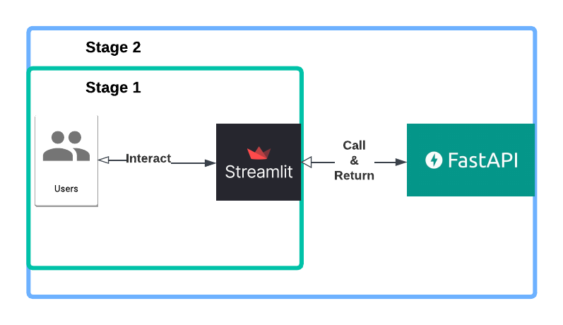

# SDA-Chatbot-Project

  

## Welcome to Stage 2 of Capstone project!

  

In this stage, we enhance our basic chatbot by **introducing FastAPI** as a backend service. Instead of making direct calls to the **OpenAI API** from the frontend, we now handle these requests through the FastAPI backend.

  

  

With this setup, when a user interacts with the Streamlit frontend, their request is sent to the FastAPI backend, which then calls the OpenAI API and returns the response.

  

By separating responsibilities, the frontend focuses on user interaction and session management, while the backend handles business logic and API calls. This modular approach ensures that as long as the backend is running, the frontend can be replaced or updated with another technology without affecting core functionality.

  

### How to Get Started

Step 1: Set Up Environment Variables

Store your OpenAI API key in a `.env` file:

  

OPENAI_API_KEY=YOUR-OPENAI-API-KEY

Step 2: Start the Backend

Before running the chatbot, start the FastAPI backend:

  

`uvicorn backend:app --reload`

Step 3: Start the Frontend

Once the backend is running, launch the Streamlit app with:

  

`streamlit run chatbot.py`

> Note: Always start the backend first to ensure the chatbot functions properly.