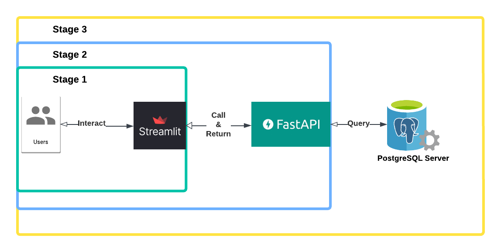

# SDA-Chatbot-Project

## Welcome to Stage 3 of Capstone project!

### Stage Introduction
In this stage, we enhance our basic chatbot, built with **Streamlit and FastAPI**, by adding **chat history storage**. Now, conversations are saved locally, and session details are logged in a **PostgreSQL database**, allowing users to continue their chats seamlessly.

  



  
Specifically, we store the  **chat ID, chat name, and file path**  of each conversation in PostgreSQL. Whenever the chatbot is reopened, it automatically retrieves the previous chat history, providing a smoother user experience.

By  **separating responsibilities**—Streamlit for the frontend, FastAPI for backend logic, and PostgreSQL for data storage—we ensure a  **flexible and maintainable**  architecture. Each component can be updated or replaced independently, making it easier to extend functionality without affecting the overall system. Additionally, this structure lays the foundation for a smooth transition to  **cloud deployment**  in future stages.

### How to Get Started
In this stage, we create a new Database called `chatbot`:

```
CREATE  DATABASE  chatbot;
```

Then, we create a   **new table** called `chats` in PostgreSQL to store chat history. Use the following schema:
```
CREATE TABLE IF NOT EXISTS chats (
    id TEXT PRIMARY KEY,
    name TEXT NOT NULL,
    file_path TEXT NOT NULL,
    last_update TIMESTAMP DEFAULT CURRENT_TIMESTAMP
);
```
#### **Step 1: Configure Environment Variables**

Store your  **OpenAI API key**  and  **database credentials**  in a  `.env`  file.

Your  `.env`  file should look like this:
 ```
OPENAI_API_KEY=YOUR-OPENAI-API-KEY
DB_NAME=YOUR-DB-NAME
DB_USER=YOUR-DB-USER
DB_PASSWORD=YOUR-DB-PASSWORD
DB_HOST=YOUR-DB-HOST
DB_PORT=YOUR-DB-PORT
```


#### **Step 2: Start the Backend**

Before running the chatbot, start the FastAPI backend using:

```
uvicorn backend:app --reload
```

#### **Step 3: Start the Frontend**

Once the backend is running, launch the Streamlit app with:

```
streamlit run chatbot.py
```
> **Note:**  Always start the backend first to ensure proper communication between components.