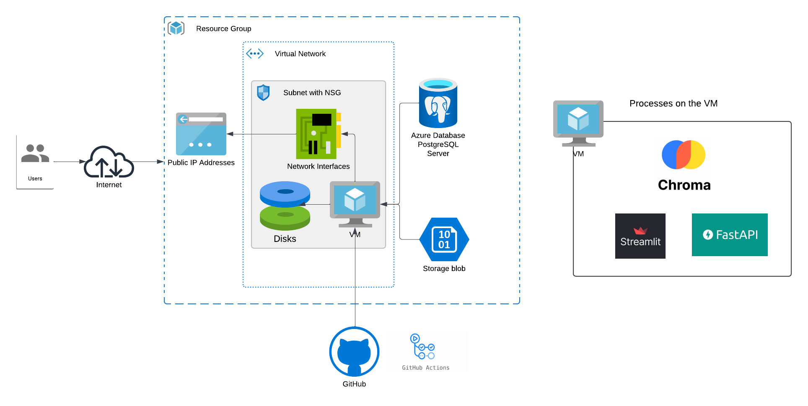
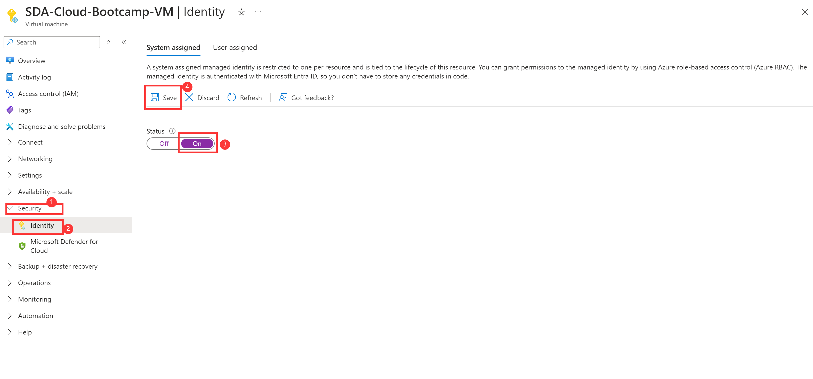
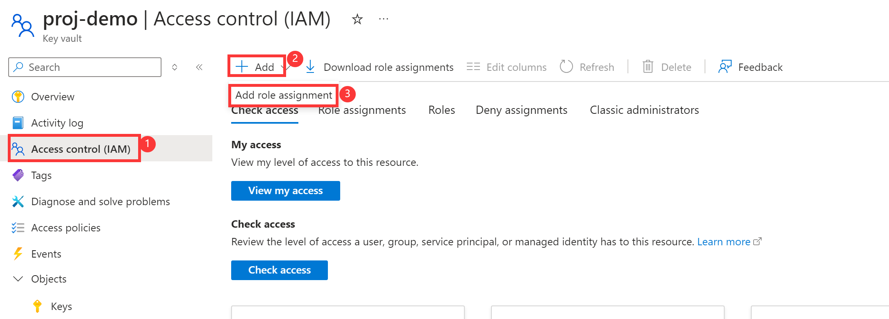
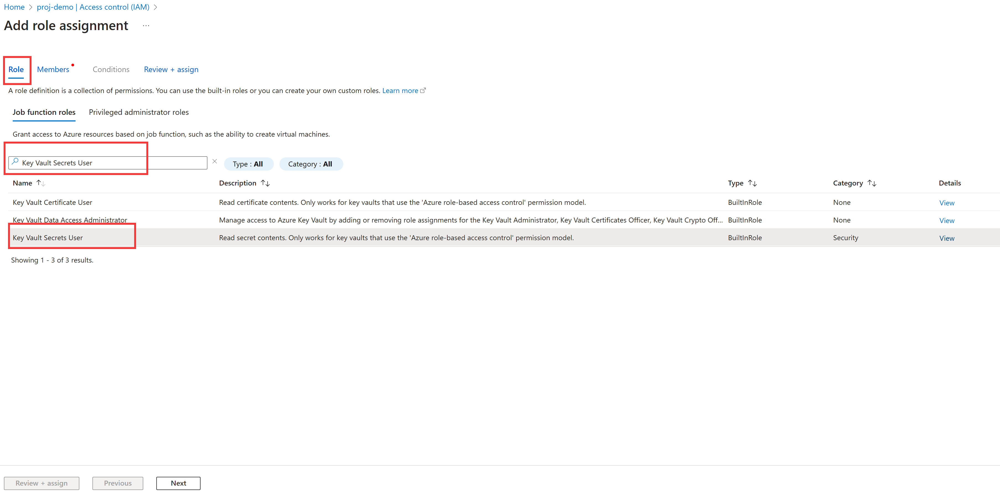
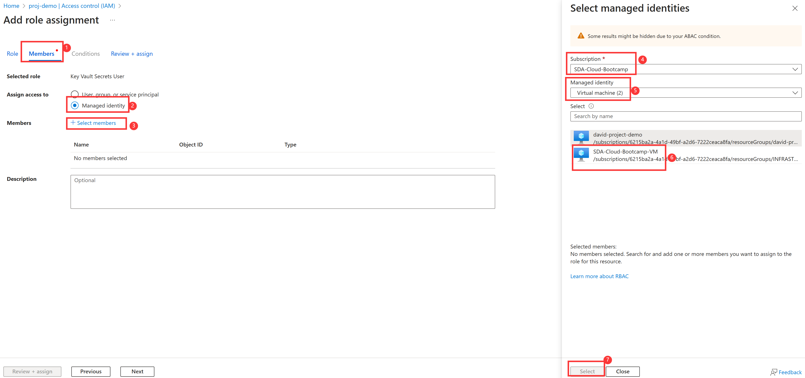
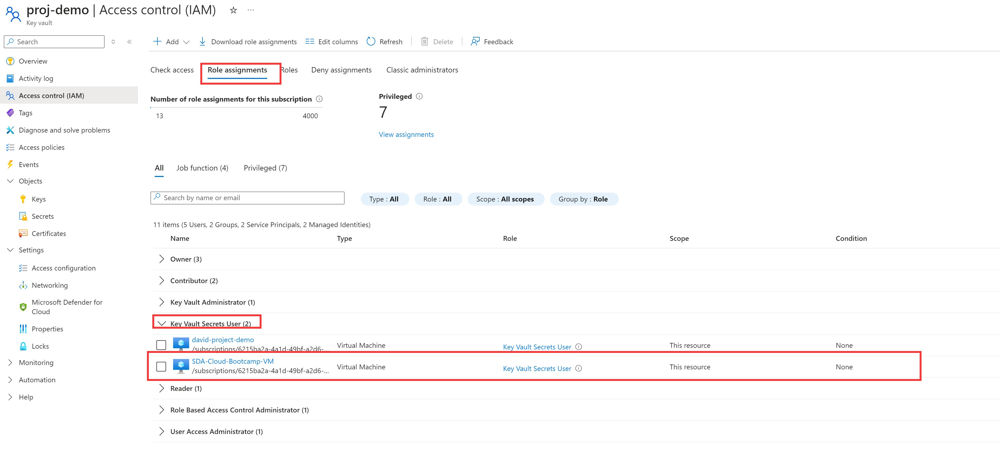

# SDA-Chatbot-Project

  

## Welcome to Stage 6 of Capstone project!

### Stage 6: Enhanced Infrastructure for Document-Aware Chatbot

In Stage 6, the **SDA-Chatbot** project introduces a robust and scalable infrastructure, integrating cutting-edge tools to support Retrieval-Augmented Generation (RAG) capabilities for document-focused chatbot interactions.

#### **Infrastructure Overview**

The system now incorporates the following components, as illustrated in the diagram:

1.  **User Interaction:**
    
    -   Users interact with the chatbot through a web interface, enabling both casual conversations and document-specific queries by uploading PDFs.
        
2.  **Secure Azure VM:**
    
    -   The core of the architecture is an Azure Virtual Machine (VM), which hosts the system’s key services within a secure environment:
        
        -   **Subnet with NSG (Network Security Group):** Provides controlled and secure access.
            
        -   **Disk Storage:** Ensures data persistence for the application and supporting services.
            
        -   **Network Interfaces:** Facilitates communication between the VM and external systems.
            
3.  **Backend Services:**
    
    -   The VM runs **Streamlit** for the user interface and **FastAPI** for backend business logic, ensuring a seamless and responsive experience.
        
4.  **Data Storage with PostgreSQL:**
    
    -   All chat data and relevant metadata are securely stored in a PostgreSQL database.
        
5.  **Chroma for Context Retrieval:**
    
    -   **Chroma**, a vector store, plays a crucial role by indexing and retrieving relevant sections of uploaded PDFs to enhance the chatbot’s ability to answer document-specific questions.
        
6.  **GitHub Actions for Automation:**
    
    -   The project leverages GitHub Actions to automate deployment and updates, ensuring continuous delivery and integration.
        

#### **Key Benefits of This Stage**

-   Enables users to interact with uploaded PDF content in a meaningful way.
    
-   Enhances response accuracy through context-aware retrieval.
    
-   Builds on the existing system architecture with scalable and modular components.
    

This expanded setup lays the foundation for future enhancements, making the chatbot not only more powerful but also ready for real-world applications.

> **Note:** The added complexity in this stage demonstrates a real-world application of RAG-based systems. Feel free to explore the infrastructure and codebase to understand how these components come together.
  

  

  

  

Under the hood, the system uses a **vector store (Chroma)** to retrieve the most relevant context from uploaded PDFs. This retrieval step enhances the chatbot’s ability to provide accurate, context-aware answers, bridging the gap between simple conversation and document-focused queries.

  

This enhancement integrates seamlessly with our existing setup—Streamlit for the user interface, FastAPI for business logic, and PostgreSQL for data storage—while laying the foundation for further expansion.

  

>  **Note:** Some LLM-related concepts introduced in this stage may seem complex. However, our main goal is to get the project running, and fully understanding the LLM integration is **optional**. If you’re interested, feel free to explore the code and additional resources to enhance your project, but don’t worry if you don’t grasp everything right away.

  

### How to Get Started
#### **Step 1: Adding custom data to the VM**

# Grant KeyVault Access To Azure VM

## 1. Set up System Managed Identity for VM
1. Navigate to your Azure VM and click `Security` then `Identity`.

2. In the *System assigned* tab change the status to **ON**, and then click `Save`.

   

## 2. Grant KeyVault Access

1. Navigate to your Azure VM and click `Access control(IAM)`.

2. Click `+Add` and then click `Add role assignment`.

   

3. In the *Role* tab, search and select `Key Vault Secrets User`.

   

4. Switch to the *Members* tab, for the `Assign access to` select `Managed identity`, and then click `+Select members`. Then in the pop-up window, select the **Subscription of your VM**, and then choose **`Virtual machine`** for the `Managed identity`, then click the **name of your VM**. Click `Select` once you selected your VM.

   

5. Finally click the `Review + assign` to finish the assignment.

6. Now in the *Role assignments* tab, you can see that the VM is already have the access. It should be under the *Key Vault Secrets User* section.

   